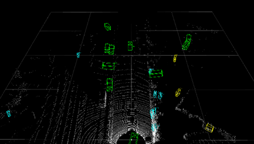
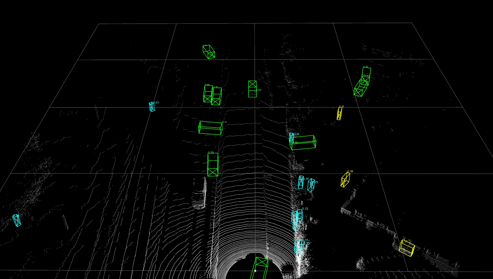
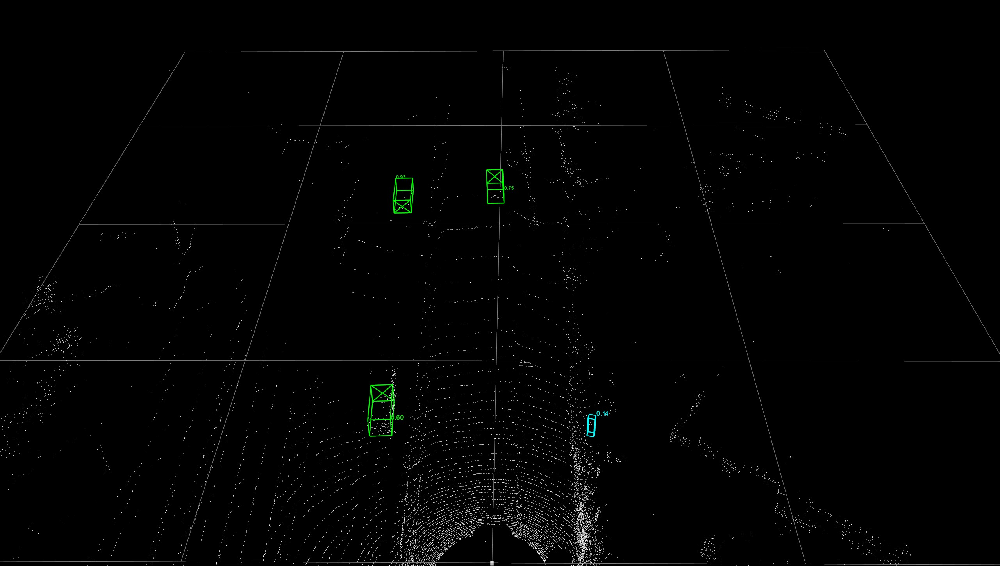
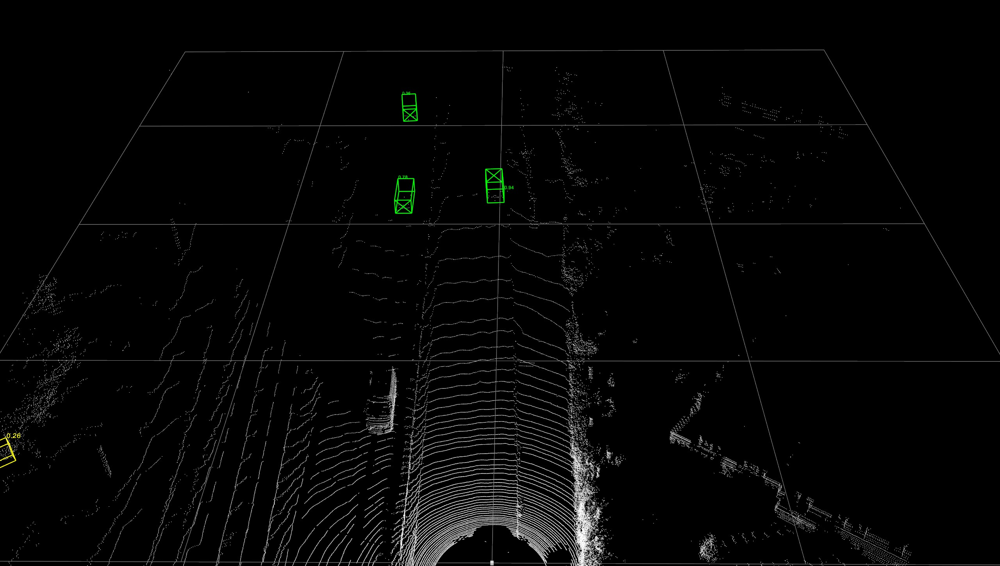

## Introduction


### What does `OpenPCDet` toolbox do?

`OpenPCDet` is a general PyTorch-based codebase for 3D object detection from point cloud. 
It currently supports multiple state-of-the-art 3D object detection methods with highly refactored codes for both one-stage and two-stage 3D detection frameworks.

Based on `OpenPCDet` toolbox, we win the Waymo Open Dataset challenge in [3D Detection](https://waymo.com/open/challenges/3d-detection/), 
[3D Tracking](https://waymo.com/open/challenges/3d-tracking/), [Domain Adaptation](https://waymo.com/open/challenges/domain-adaptation/) 
three tracks among all LiDAR-only methods, and the Waymo related models will be released to `OpenPCDet` soon.    

We are actively updating this repo currently, and more datasets and models will be supported soon. 
Contributions are also welcomed. 

### `OpenPCDet` design pattern

* Data-Model separation with unified point cloud coordinate for easily extending to custom datasets:
<p align="center">
  
</p>

* Unified 3D box definition: (x, y, z, dx, dy, dz, heading).

### Requirements
All the codes are tested in the following environment:
•	Linux (tested on Ubuntu 20.04)
•	Python.9.16
•	PyTorch 1.13.0
•	CUDA 11.7
•	spconv v2.x

### PointPillars on the KITTI Dataset
### Overview
**PointPillars** is renowned for its unique combination of high inference speed and accuracy. On the esteemed KITTI dataset for autonomous vehicles, it achieves an unparalleled speed of 62 fps. This performance is substantially ahead of many contemporary models in the domain.

### 3D Point Clouds & Pillar Formation
In 3D object detection, the raw data often arrives in the form of a point cloud: a collection of data points that represent the external surfaces of objects in three-dimensional space. PointPillars approach views these points from a top-down perspective, effectively categorizing them into x-y grids or 'pillars'. The partitioning of points is fundamentally based on two parameters:
- **P**: Number of non-empty pillars per sample.
- **N**: Number of points encapsulated in each pillar.

Each point within this cloud starts as a 4D vector `(x, y, z, reflectance)`. Through the process, it's transformed into a 9D vector by augmenting with:
- **Xc, Yc, Zc**: Distances from the pillar's arithmetic mean.
- **Xp, Yp**: Distance from the center of its pillar in the x-y plane.

This gives us the detailed representation: **D = [x, y, z, r, Xc, Yc, Zc, Xp, Yp]**. From these transformations, a dense tensor of dimensions `(D, P, N)` is formed. Depending on the pillar's data volume, the tensor is either populated through random sampling or zero-padding.

### PointNet for Feature Extraction
**PointNet** takes center stage for feature extraction. Unlike conventional networks that expect uniformity in input data, PointNet can directly process point clouds, respecting their unordered and irregular nature. It treats each point individually, exposing it to a series of transformations to derive high-level features. 

After PointNet's operations, the resultant tensor dimensions stand at `(C, P, N)`. A subsequent max pooling operation condenses this to `(C, P)`. Using the indices of each point, the tensor is realigned to its original pillar structure. This essentially replaces the primary D-dimensional vector of each point with a C-dimensional feature vector.

### Backbone and Detection Head
The architectural backbone consists of cascading 3D convolutional layers. Their purpose is to distill features from the processed input at various scales. For pinpointing objects, the **SSD (Single Shot Multibox Detector)** is brought into play as the detection head. Originating from 2D image detection, the SSD, in this context, has been adapted to predict additional parameters suited for 3D data, specifically height, and elevation.

#### Bounding Box Attributes:
- **x**: Center coordinates on the x-axis (lengthwise).
- **y**: Center coordinate on the y-axis (widthwise).
- **z**: Vertical bottom-center coordinate.
- **l**: Box length (longest dimension on the ground).
- **w**: Box width (shortest dimension on the ground).
- **h**: Box height (vertical measurement).
- **θ (theta)**: Object's rotational angle around the z-axis, signifying its orientation.

The insights and implementations are inspired and derived from the repository of [OpenPCDet](https://github.com/open-mmlab/OpenPCDet).

### Pointpillar Results with Benchmarking KITTI Dataset.


### Pointpillar Results with RAW KITTI Dataset.


### Difference Bteween Benchmarking KITTI Dataset and Raw KITTI Dataset
Firstly, we will discuss the difference between benchmarking the KITTI dataset and the Raw KITTI dataset.

## Table 1. Comparing Benchmarking and Raw KITTI

|                                 | Benchmarking KITTI                                                                                      | Raw KITTI                                                                                                        |
|---------------------------------|--------------------------------------------------------------------------------------------------------|------------------------------------------------------------------------------------------------------------------|
| **Subset of the KITTI dataset** | This subset of the KITTI dataset is specifically organized and labeled for the task of 3D object detection | The raw data doesn't come with task-specific labels like 3D bounding boxes for objects.                          |
| **Data Included**               | It includes LiDAR point clouds and corresponding camera images, along with calibration data.             | The raw dataset provides the full data for every drive. This includes all sensor data such as LiDAR, images from multiple cameras, GPS, IMU, etc. |


### Pointpillar Results with Raw KITTI Dataset


### PointRCNN with Raw  KITTI Dataset


### PVRCNN with Raw  KITTI Dataset


### Why Pointpillar performed better?

- Pointpillar is designed to be more efficient by converting the 3D point cloud into a pseudo-image (2D representation) and then performing 2D convolutions. This simpler design can be more robust to noise and variations, especially if the more complex models are not fine-tuned.
- PV-RCNN and PointRCNN are more intricate and might perform better when finely tuned on the specific dataset. When applied directly without fine-tuning on raw data, they might not achieve their peak performance.
- The raw KITTI dataset might contain more noise or unfiltered points from the LiDAR. PointPillar's design, which involves grid-based pooling, inherently acts as a noise filter, making it more robust to such unprocessed data.
- If the models (PV-RCNN, PointRCNN) were trained intensively on the benchmark KITTI dataset, they might have unintentionally learned some specific characteristics of that dataset that do not generalize well to the raw KITTI dataset or other datasets. This over-optimization for the benchmark data can hinder performance when the model encounters raw or different data distributions.


### KITTI Dataset Benchmarking
(Insert benchmarking details, graphs, charts, and other relevant visual aids here.)

## Model Zoo

### KITTI 3D Object Detection Baselines
Selected supported methods are shown in the below table. The results are the 3D detection performance of moderate difficulty on the *val* set of KITTI dataset.
* All LiDAR-based models are trained with 8 GTX 1080Ti GPUs and are available for download. 
* The training time is measured with 8 TITAN XP GPUs and PyTorch 1.5.

|                                             | training time | Car@R11 | Pedestrian@R11 | Cyclist@R11  | download | 
|---------------------------------------------|----------:|:-------:|:-------:|:-------:|:---------:|
| [PointPillar](tools/cfgs/kitti_models/pointpillar.yaml) |~1.2 hours| 77.28 | 52.29 | 62.68 | [model-18M](https://drive.google.com/file/d/1wMxWTpU1qUoY3DsCH31WJmvJxcjFXKlm/view?usp=sharing) | 
| [PointRCNN](tools/cfgs/kitti_models/pointrcnn.yaml) | ~3 hours | 78.70 | 54.41 | 72.11 | [model-16M](https://drive.google.com/file/d/1BCX9wMn-GYAfSOPpyxf6Iv6fc0qKLSiU/view?usp=sharing)| 
| [PV-RCNN](tools/cfgs/kitti_models/pv_rcnn.yaml) | ~5 hours| 83.61 | 57.90 | 70.47 | [model-50M](https://drive.google.com/file/d/1lIOq4Hxr0W3qsX83ilQv0nk1Cls6KAr-/view?usp=sharing) |

## Installation

Please refer to [INSTALL.md](docs/INSTALL.md) for the installation of `OpenPCDet`.


## Quick Demo
Please refer to [DEMO.md](docs/DEMO.md) for a quick demo to test with a pretrained model and 
visualize the predicted results on your custom data or the original KITTI data.

## Getting Started

Please refer to [GETTING_STARTED.md](docs/GETTING_STARTED.md) to learn more usage about this project.


## License

`OpenPCDet` is released under the [Apache 2.0 license](LICENSE).

## Acknowledgement
`OpenPCDet` is an open source project for LiDAR-based 3D scene perception that supports multiple
LiDAR-based perception models as shown above. Some parts of `PCDet` are learned from the official released codes of the above supported methods. 
We would like to thank for their proposed methods and the official implementation.   

We hope that this repo could serve as a strong and flexible codebase to benefit the research community by speeding up the process of reimplementing previous works and/or developing new methods.


## Citation 
If you find this project useful in your research, please consider cite:


```
@misc{openpcdet2020,
    title={OpenPCDet: An Open-source Toolbox for 3D Object Detection from Point Clouds},
    author={OpenPCDet Development Team},
    howpublished = {\url{https://github.com/open-mmlab/OpenPCDet}},
    year={2020}
}
```

## Contribution
Welcome to be a member of the OpenPCDet development team by contributing to this repo, and feel free to contact us for any potential contributions. 


